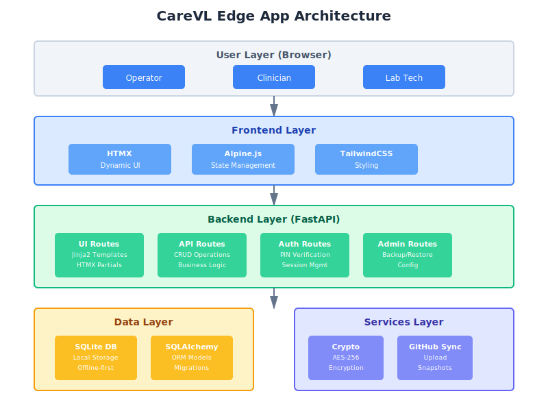
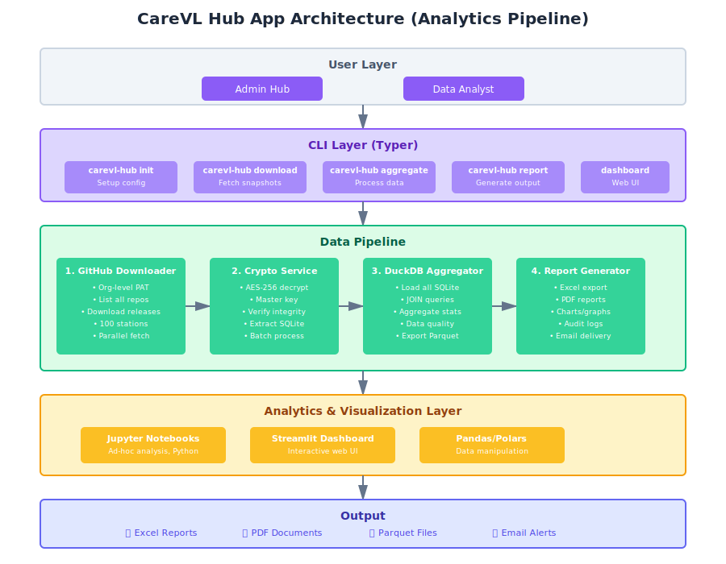
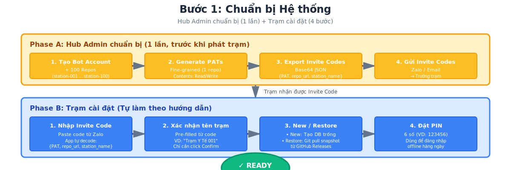
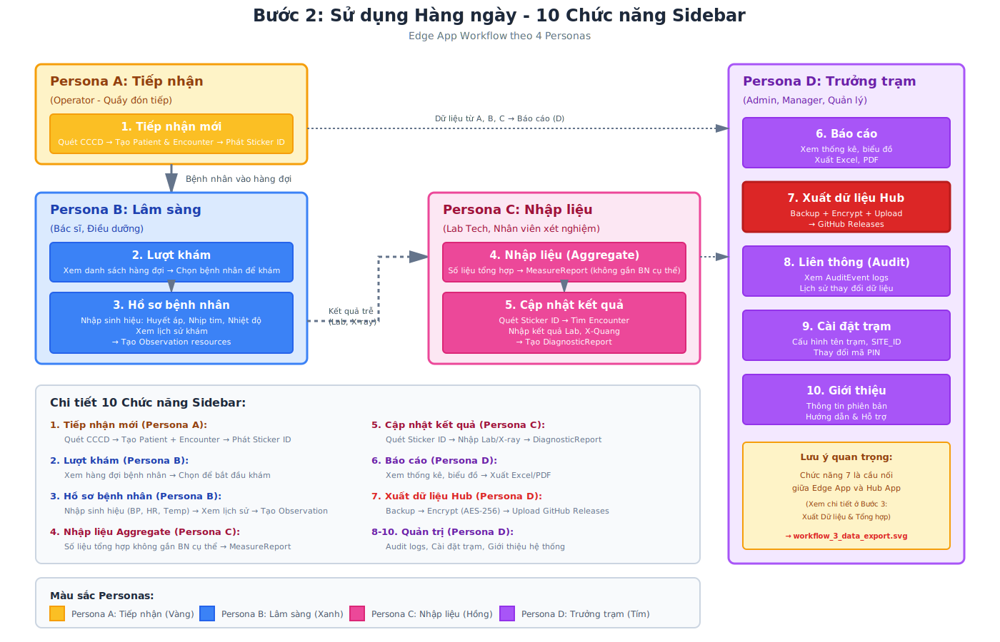
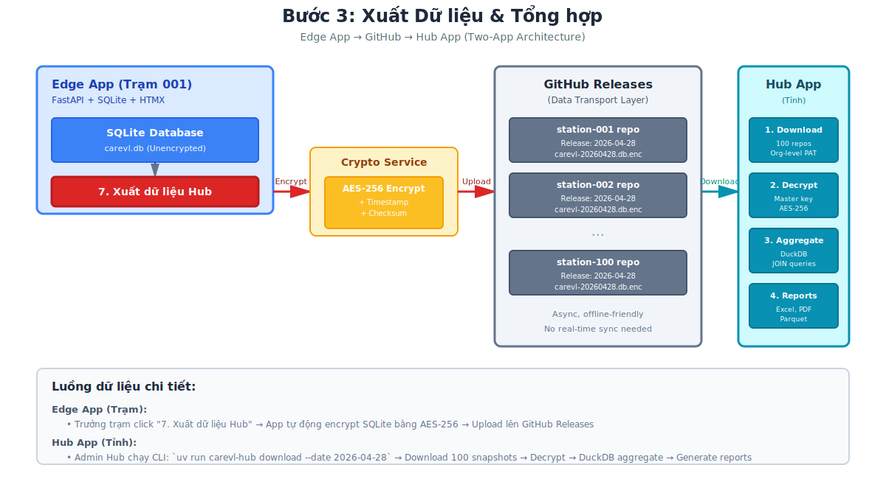
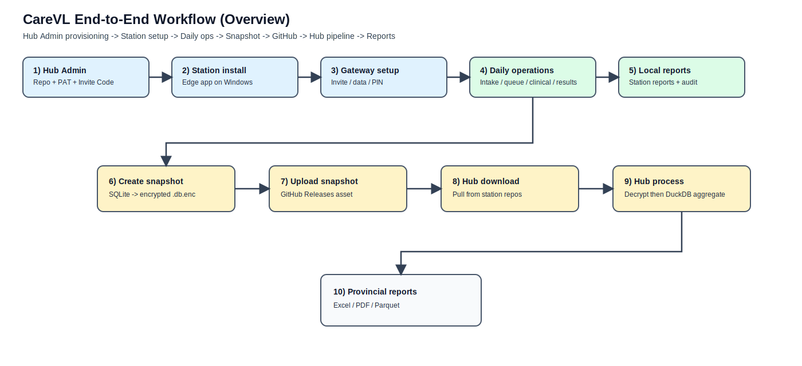
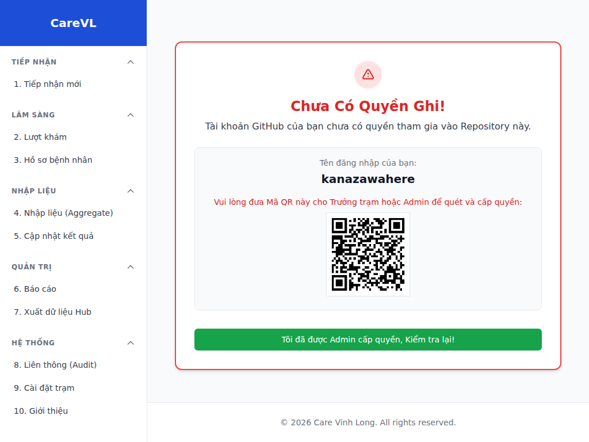
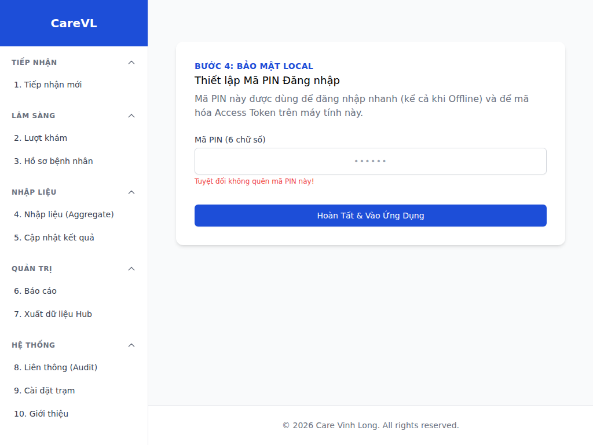

# Visualization Catalog (All Diagrams & Mockups)

Ten file trong repo: `AGENTS/ACTIVE/26_Visualization.md` (day la catalog visualization tong hop; khong dat `.md` o root vi quy tac `AGENTS.md`).

## Status
[Active]

## Context
Can mot file mo len la thay **tat ca hinh anh / so do** trong `AGENTS/ASSETS/` va **bang di kem** (mo ta nghiep vu, schema/dataflow neu co), khong phai nhay qua nhieu tai lieu.

## Decision
Dung file nay lam **catalog visualization duy nhat** cho repo CareVL.

- Duong dan asset: `../ASSETS/<ten_file>`
- Mockup UI: khong co schema ky thuat day du, bang di kem la **mo ta man hinh + muc tieu**.
- So do kien truc / workflow SVG: bang di kem la **thanh phan chinh + luong du lieu**.

## Rationale
Mot catalog scroll duoc giup nguoi va AI doc nhanh, giam phan tan link roi rac.

## Related Documents
- [24. Verified State Machine Diagramming](24_Verified_State_Machine_Diagramming.md)
- [18. Two-App Architecture: Edge vs Hub](18_Two_App_Architecture.md)
- [TUTORIAL.md](../../TUTORIAL.md)

---

## Architecture & workflow (SVG)

### `edge_app_architecture.svg`

| Thanh phan chinh | Vai tro |
|---|---|
| Edge App (FastAPI + HTMX) | UI + API tai tram |
| Station SQLite | Du lieu offline-first |
| Snapshot .db.enc | Backup / dong bo artifact |
| GitHub Releases | Kenh luu tru snapshot |

---

### `hub_app_architecture.svg`

| Thanh phan chinh | Vai tro |
|---|---|
| Hub CLI | Tai va xu ly snapshot tu nhieu tram |
| Decrypt | Giai ma snapshot |
| DuckDB | Tong hop / truy van |
| Hub Reports | Bao cao tinh |

---

### `hub_app_diagram.svg`

| Thanh phan chinh | Ghi chu |
|---|---|
| Hub pipeline | So do tong quan luong xu ly Hub (CLI / data) |

---

### `workflow_1_preparation.svg`

| Buoc | Muc tieu |
|---|---|
| Hub Admin chuan bi | Repo + PAT + invite |
| Station cai dat | Edge app san sang |
| Gateway | Khoi tao du lieu + PIN |

---

### `workflow_2_daily_usage.svg`

| Nhom | Muc tieu |
|---|---|
| Personas | Tiep nhan / Lam sang / Nhap lieu / Truong tram |
| Sidebar | 10 chuc nang dieu huong |

---

### `workflow_3_data_export.svg`

| Buoc | Muc tieu |
|---|---|
| Snapshot | Dong goi SQLite ma hoa |
| GitHub Releases | Luu tru |
| Hub | Tai + giai ma + tong hop |

---

### `overview_end_to_end.svg`

| Giai doan | Muc tieu |
|---|---|
| Setup -> Van hanh | Tram hoat dong hang ngay |
| Xuat du lieu | Snapshot len Hub |
| Tong hop | Bao cao cap tinh |

---

## UI mockups & product shots (PNG)

### `01_mockup_github_auth.png`

| Man hinh | Hanh dong chinh | Ket qua mong doi |
|---|---|---|
| Nhap Invite Code | Paste code -> Xac nhan | He thong nhan dien tram + repo |

---

### `02_mockup_repo_config.png`

| Man hinh | Hanh dong chinh | Ket qua mong doi |
|---|---|---|
| Xac nhan tram | Kiem tra ten tram | Xac nhan thong tin truoc khoi tao |

---

### `03_mockup_permission_gate.png`

| Man hinh | Hanh dong chinh | Ket qua mong doi |
|---|---|---|
| Permission gate | Kiem tra quyen / trang thai | Chi cho tiep khi hop le |

---

### `04_mockup_data_setup_restore.png`

| Man hinh | Hanh dong chinh | Ket qua mong doi |
|---|---|---|
| Khoi tao du lieu | New DB hoac Restore Snapshot | DB tram san sang tiep tuc |

---

### `05_mockup_pin_setup.png`

| Man hinh | Hanh dong chinh | Ket qua mong doi |
|---|---|---|
| PIN offline | Nhap PIN 6 so | Mo khoa van hanh hang ngay |

---

### `sidebar_desktop.png`

| Man hinh | Muc tieu |
|---|---|
| Sidebar desktop | Dieu huong 10 chuc nang ro rang |

---

### `sidebar_active_state.png`

| Man hinh | Muc tieu |
|---|---|
| Active state | Hien thi muc dang chon / trang thai active |

---

### `sidebar_placeholder.png`

| Man hinh | Muc tieu |
|---|---|
| Placeholder | Giu layout khi tinh nang chua hoan tat |

---

### `sync_complete.png`

| Man hinh | Muc tieu |
|---|---|
| Sync / backup hoan tat | Xac nhan tac vu xuat / dong bo thanh cong |

---

## Ghi chu cho tac nhan AI

- Day la **noi duy nhat** can mo de quet toan bo visualization trong `AGENTS/ASSETS/`.
- Neu can **schema contracts + dataflow transactions** day du cho state machine, tiep tuc doc [24. Verified State Machine Diagramming](24_Verified_State_Machine_Diagramming.md).
